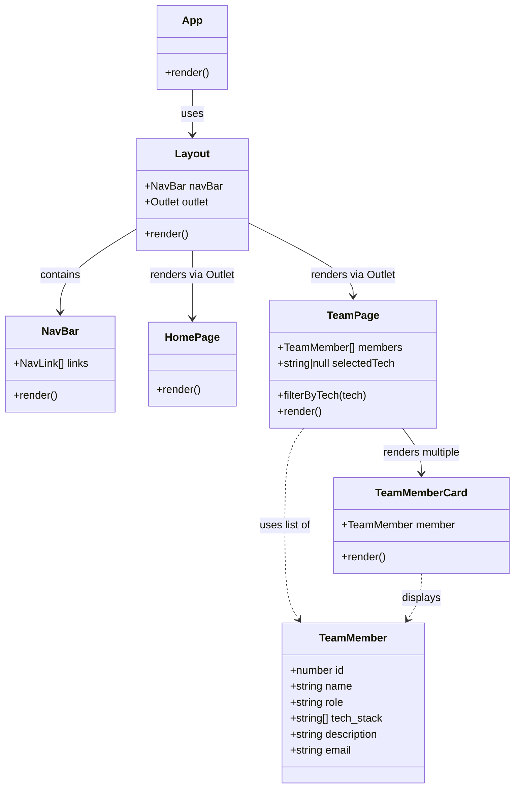

# Class Diagram - Data & Component Structure

```mermaid
classDiagram
    %% Data Models
    class TeamMember {
        +number id
        +string name
        +string role
        +string[] tech_stack
        +string description
        +string email
    }

    %% Components
    class App {
        +render()
    }

    class Layout {
        +NavBar navBar
        +Outlet outlet
        +render()
    }

    class NavBar {
        +NavLink[] links
        +render()
    }

    class HomePage {
        +render()
    }

    class TeamPage {
        +TeamMember[] members
        +string|null selectedTech
        +filterByTech(tech)
        +render()
    }

    class TeamMemberCard {
        +TeamMember member
        +render()
    }

    %% Relationships
    App --> Layout : uses
    Layout --> NavBar : contains
    Layout --> HomePage : renders via Outlet
    Layout --> TeamPage : renders via Outlet
    TeamPage --> TeamMemberCard : renders multiple
    TeamPage ..> TeamMember : uses list of
    TeamMemberCard ..> TeamMember : displays
```
