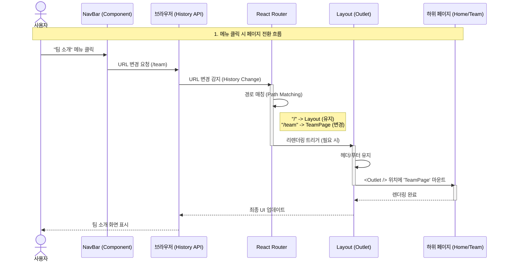
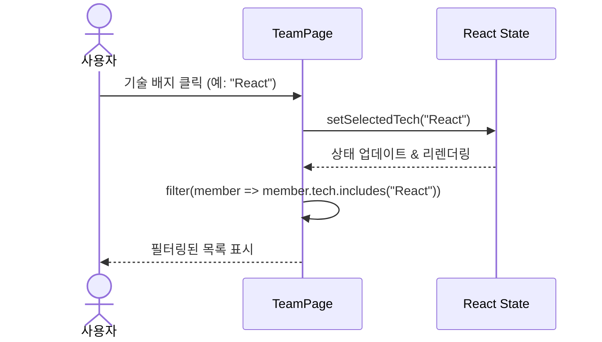

# Sequence Diagram - Router & Outlet Interaction

사용자가 메뉴를 클릭했을 때 라우터와 Outlet이 어떻게 작동하는지 보여주는 흐름도입니다.

```mermaid
sequenceDiagram
    actor User as 사용자
    participant NavBar as NavBar (Component)
    participant Browser as 브라우저 (History API)
    participant Router as React Router
    participant Layout as Layout (Outlet)
    participant Page as 하위 페이지 (Home/Team)

    Note over User, Page: 1. 메뉴 클릭 시 페이지 전환 흐름

    User->>NavBar: "팀 소개" 메뉴 클릭
    NavBar->>Browser: URL 변경 요청 (/team)
    Browser->>Router: URL 변경 감지 (History Change)
    
    activate Router
    Router->>Router: 경로 매칭 (Path Matching)
    Note right of Router: "/" -> Layout (유지)<br>"/team" -> TeamPage (변경)
    
    Router->>Layout: 리렌더링 트리거 (필요 시)
    deactivate Router

    activate Layout
    Layout->>Layout: 헤더/푸터 유지
    Layout->>Page: <Outlet /> 위치에 'TeamPage' 마운트
    deactivate Layout

    activate Page
    Page-->>Layout: 렌더링 완료
    deactivate Page
    
    Layout-->>Browser: 최종 UI 업데이트
    Browser-->>User: 팀 소개 화면 표시
```

## 참고: 팀원 목록 필터링 시퀀스

```mermaid
sequenceDiagram
    actor User as 사용자
    participant TeamPage as TeamPage
    participant State as React State

    User->>TeamPage: 기술 배지 클릭 (예: "React")
    TeamPage->>State: setSelectedTech("React")
    State-->>TeamPage: 상태 업데이트 & 리렌더링
    TeamPage->>TeamPage: filter(member => member.tech.includes("React"))
    TeamPage-->>User: 필터링된 목록 표시
```
